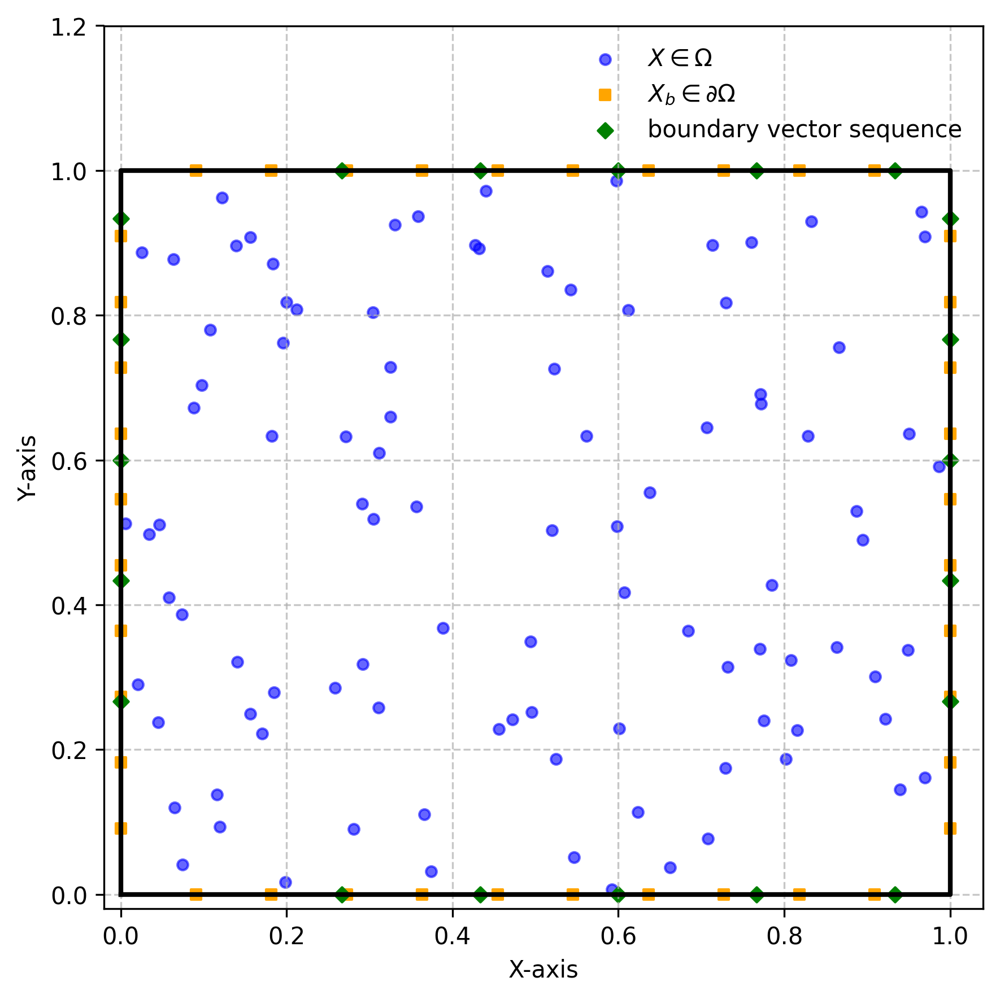

## Environment setup:
__Navigate to the directory where the code is cloned__
### creating the virtual environment (make sure to use python version == 3.10.x):
    python3 -m venv pinto
    source ~/pinto/bin/activate
    pip install -r requirements.txt

## Documentation:
Each __Numerical Example folder__ consists of three subfolders: _Code_, _Post_Processing_, and _Trained_models_
### About Folders:
- Numerical examples/
  - Code/
    - PINTO/ 
      - model file, Pde file, utils 
    - DeepONets/ 
      - model file, Pde file, utils 
  - Post_processing/ 
    - Post_Processing.ipynb - contains the code for post-processing and plots in paper of corresponding test cases 
  - Trained models/ 
    - have the trained models of PINTO and DeepONets for corresponding test cases

__Below links provide the data for Advection and Burgers equation.__
- [Advection PDEBENCH Dataset](https://darus.uni-stuttgart.de/file.xhtml?fileId=255672&version=8.0)
- [Burger](https://indianinstituteofscience-my.sharepoint.com/:u:/g/personal/ksumanth_iisc_ac_in/EWeItMUTYulKit8tqgKnh44BzzUDxc-whoJadi2QjGLBuA?e=IYR3p0)
- __Before running the Advection/Burgers example, make sure to give the correct path of the data directory in the model.py file (_data-dir_)__
- __Run the script.sh, file prompts the required example and model to run the code.__
### File Execution:
    chmod +x script.sh
    ./script.sh

# Detailed Documentation
## PdeModel class:
__Attributes__
- inputs: domain/boundary/initial coordinates for QPE units,
         initial/boundary coordinates sequence for BPE units, initial/boundary conditions sequence for BVE units
 - outputs: scalar/vector quantities of our interest
 - model: PINTO/DeepONet model object (built using Tensorflow Functional API)
 - optimizer: optimizer object
 - loss_fn: loss function object
 - parameters: Governing equations parameters (Re, nue, beta, etc.)
 - inner/bound/init_data: Tensorflow dataset object
 - batches
 - loss_tracker: metrics to track the various loss terms during training
 - Methods
    - __init__: constructor to initialize the attributes
    - create_data_pipeline: to create the TensorFlow dataset for training/validation
    - Pde_residual: to compute the PDE residuals of corresponding numerical examples using Automatic Differentiation
    - train_step: to perform a single training step (which essentially consists of four major steps)
        - Forward pass
        - Compute loss
        - Backward pass (computing gradients using backpropagation)
        - Update weights (applying gradients to the model weights using the optimizer)
    - test_step: to perform a single test step (which essentially consists of two major steps)
        - Forward pass
        - Compute loss
    -reset_metrics: to reset the loss metrics at the beginning of each epoch
    -get_model_graph: to get the PINTO/DeepONet model plot
    -run: performs the training of the model for a provided number of epochs
    -prediction: to perform the prediction of the model for given input coordinates
    -get_plots: to get the plots of the model predictions at regular intervals (plot_freq in run method defines the interval to plot)
 ## utils.py
  
### Data generation:
1. Collocation points are generated using the Latin Hypercube Sampling (LHS) method
2. Boundary/initial points to impose boundary/initial conditions (either on grid points or randomly chosen points with the initial/boundary condition, 
__only for boundary and initial conditions simulation data file is used__)
3. boundary vector sequence points for BPE and BVE units are chosen randomly on all sides of the boundary 
4. For each collocation and initial/boundary point, the same boundary vector sequence is used as input to BPE and BVE units.
5. The above image shows data generation on the 2D domain (X-Y).

- The utils file has been updated with detailed documentation in generating and creating the dataset to train the model.
- contains the functions to create the input coordinates for QPE, BPE, and BVE units.
- contains the functions to create the initial/boundary conditions for QPE, BPE, and BVE units.
## model.py
- it is a config file to build and run the model with the  following attributes:
  - model_type: PINTO/DeepONet using Tensorflow Functional API
  - data_dir: path to the dataset
  - batch_size: batch size for training
  - epochs: number of epochs for training
  - plot_freq: frequency of plotting the model predictions during training
  - learning_rate: learning rate for the optimizer
  - optimizer: optimizer type (Adam, AdamW, etc.)
  - loss_fn: loss function type (MSE)
  - lr_Schedule: learning rate schedule type (ExponentialDecay, PolynomialDecay, etc.)
  - PdeModel: PdeModel class object
  - wandb: wandb object for logging the training process (True/False)
  - metrics: metrics to track the training process (MAE)
  ## Citations
      @article{boya2024physics,
      title={A physics-informed transformer neural operator for learning generalized solutions of initial boundary value problems},
      author={Boya, Sumanth Kumar and Subramani, Deepak},
      journal={arXiv preprint arXiv:2412.09009},
      year={2024}} 
